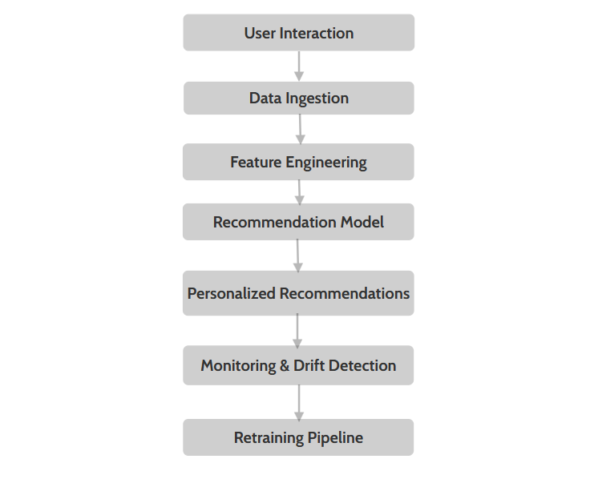

# ML_Engineer_Assessment
## Task 1: Data Exploration & Preprocessing

In this task, the Titanic dataset was explored and prepared for machine learning modeling.
Initial analysis was performed to understand the structure of the data, feature types,
and missing values.

Key preprocessing steps included:
- Handling missing values in numerical and categorical features
- Encoding categorical variables such as gender and embarkation port
- Feature engineering such as creating FamilySize and IsAlone features
- Removing non-informative or irrelevant columns

This step ensured that the dataset was clean, structured, and suitable for model training.

## Task 2: Model Training & Evaluation

After preprocessing, the dataset was split into training and testing sets.
Multiple classification models were trained to predict passenger survival.

Models evaluated included:
- Logistic Regression
- Random Forest Classifier

Model performance was evaluated using accuracy as the primary metric.
Cross-validation was applied to ensure consistency across different data splits.

Initial results showed very high accuracy, indicating strong patterns present in the data.

## Task 3: Model Analysis & Overfitting Investigation

During this task, the model achieved unusually high accuracy (up to 100%),
which raised concerns about potential overfitting.

Further analysis revealed that the Titanic dataset is relatively small and
contains highly predictive features such as passenger gender and class.
These dominant features allowed the model to memorize patterns rather than generalize.

To validate this hypothesis:
- Regularization was applied to Logistic Regression
- Dominant features were selectively removed
- Cross-validation was re-evaluated

The drop in performance after removing strong predictors confirmed that the
initial perfect accuracy was due to feature dominance and dataset simplicity,
not true generalization.

This task demonstrates critical model evaluation, hypothesis testing,
and an understanding of real-world ML limitations.

## Task 4: ML System Design – Recommendation System

### Overview
This section describes the design of a production-ready machine learning
recommendation system that provides personalized recommendations to users
based on their past interactions and preferences.

### 1. Data Ingestion
User interaction data is collected from multiple sources such as clicks,
views, ratings, and purchase history.
This data is ingested in batch or real time and stored in a centralized
data storage system.

### 2. Training Pipeline
Historical user-item interaction data is processed to create features
such as user preferences and item popularity.
Machine learning models such as collaborative filtering or content-based
filtering are trained using this processed data.
The trained model is versioned and stored for deployment.

### 3. Inference Flow
When a user interacts with the system, the trained recommendation model
generates personalized item recommendations in real time.
These recommendations are then displayed to the user through the application
interface.

### 4. Monitoring & Drift Detection
Model performance is continuously monitored using metrics such as click-through
rate (CTR) and user engagement.
Data drift detection techniques are applied to identify changes in user behavior
or item trends that may reduce recommendation quality.

### 5. Retraining Strategy
The recommendation model is retrained periodically using newly collected user
interaction data.
Retraining is also triggered when monitoring indicates a drop in performance
or changes in user preferences.

### System Flow Diagram

